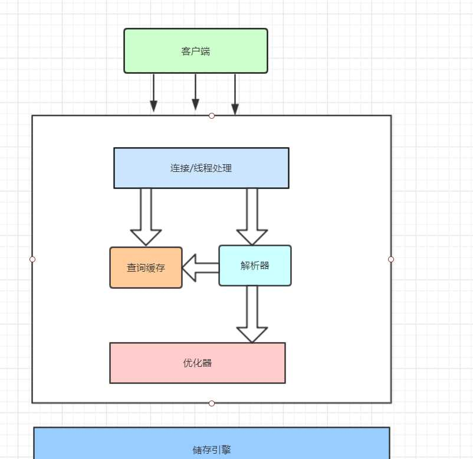

## 对MySql的认识
首先，MySql 并不完美，却足够灵活，能够适应高要求的环境，例如web类应用，同时，MySql既可以嵌入应用程序中，也可以支持数据仓库、内容索引和部署软件、高可用的冗余系统，在线事务处理系统（OLTP）等各种应用。mysql 最重要，最出众不同的特性是它的存储引擎架构， 将查询处理及系统任务和数据的存储/提取分离  
### 1.1 结构
MySQL架构如下  (盗图)  
  
第一层：客户端连接，包括了 连接处理，授权认证，安全等等。（连接线程池）  
第二层：服务层 包括了 查询解析、分析、优化、缓存   
第三层：存储引擎，负责数据的提前与存储  

### 1.2 我们应该了解  
#### 1，并发控制  
mysql操作离不开读和写，有读和写在高并发的情况就会出现并发问题。那么最好的办法就是锁。锁有两种类型一个是共享锁一个是排它锁，也叫读锁和写锁。读锁是共享的，互不阻塞，写锁是排它的，也就是说一个写锁会阻塞其他读锁与写锁。只要这样的安全策略才能保证只有一个用户能执行写入，并防止其他用户读取正在写入的同一资源。mysql中有表锁、行锁等锁粒度。所有存储引擎都以自己的方式显现锁机制。  
多版本并发控制MVCC  
2，事务  
事务就是一组原子性的SQL查询，要么全部执行成功，要么全执行失败。  
最好的栗子就是银行的那个栗子。很香。  
特点：  
原子性  原子操作  
一致性  要么。。。要么。。。  
隔离性  没提交前对其他操作是不可见的  
持久性  安全吧  
隔离级别：  

级别 | 脏读 | 不可重复读 | 幻读 | 加锁读
 ---- | ----- | ------  | ------ | ----
READ UNCOMMITTED | YES | YES | YES | NO
READ COMMITTED | NO | YES | YES | NO 
Repeatable read | NO | NO | YES | NO
Serializable | NO | NO | NO | YES
 
我们应该避免死锁 和 遇到死锁怎么处理的方案  
事务是合理的 死锁是bug  

#### 3，存储引擎  
1，InnoDB  
是mysql的默认事务型引擎，也是最重要，最广泛的。 自动崩溃恢复特性。
* 采用MVCC支持高并发 默认Repeatable read + 间隙锁防幻读
* 表采用聚簇索引，主键查询性能高（主键应尽可能的小）
* 读取数据时采用的可预测性读，自动在内存建立hash索引加速读操作以及快速插入缓存区  

2，MyISAM  
支持全文索引，压缩，空间函数但是不支持事务和行级锁。崩溃后无法恢复。适用于表小，只读的  

3，其他  
没用到过，但是有很多，包括第三方  

